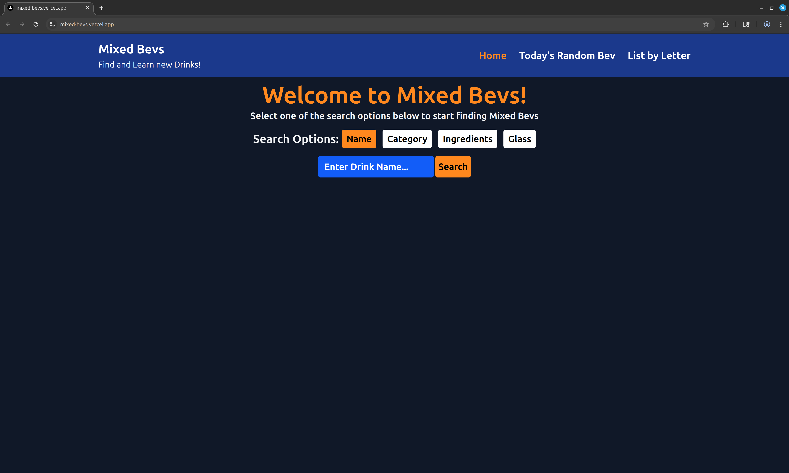

# Mixed Bevs, Next.js Website with Tailwind CSS, React, and TypeScript

# 🚀 Features
- Users can search drinks in multiple ways (by name, ingredient, category, etc.)
- Learn details and how to create each drink using data from TheCocktailDB API
- Get a random mixed bev daily

## 🔗 Live Demo

👉 [View Live Site](https://mixed-bevs.vercel.app/)

## 📸 Screenshot

